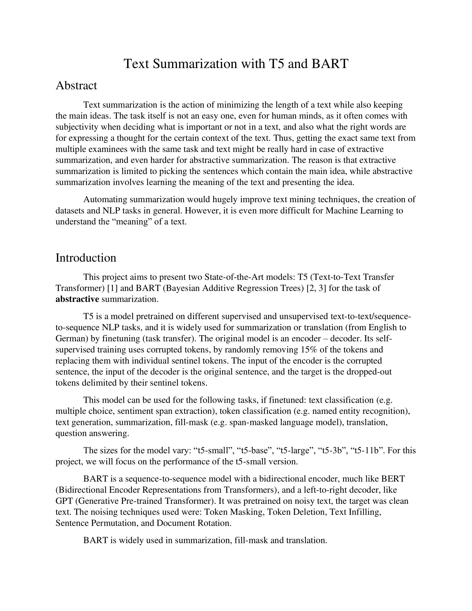

# Text Summarization with T5 and BART

A comprehensive project for fine-tuning and testing T5 and BART transformer models for text summarization tasks using the XSUM dataset.




## 📋 Overview

This project implements text summarization using state-of-the-art transformer models:
- **T5 (Text-To-Text Transfer Transformer)**: Google's encoder-decoder model
- **BART (Bidirectional and Auto-Regressive Transformers)**: Facebook's denoising autoencoder

The models are fine-tuned on the **XSUM (Extreme Summarization)** dataset, which contains BBC news articles and their corresponding single-sentence summaries.

## 🚀 Features

- Fine-tuning of pre-trained T5 and BART models
- Training pipeline with customizable hyperparameters
- Evaluation using ROUGE metrics
- Easy-to-use inference pipeline for generating summaries
- Support for both T5 and BART model architectures

## 📦 Installation

### Prerequisites

- Python 3.7+
- TensorFlow 2.x
- CUDA-compatible GPU (recommended for training)

### Setup

1. Clone the repository:
```bash
git clone https://github.com/StegarescuAnaMaria/Text_Summarization_with_T5_and_BART.git
cd Text_Summarization_with_T5_and_BART
```

2. Install required dependencies:
```bash
pip install tensorflow transformers datasets rouge-score nltk numpy
```

3. Download NLTK data (if needed):
```python
import nltk
nltk.download('punkt')
```

## 📚 Usage

### Training a Model

1. Open `Summarization training.ipynb`
2. Configure hyperparameters in the configuration cell:
   - `MODEL_CHECKPOINT`: Choose between `"t5-small"` or `"facebook/bart-base"`
   - `TRAIN_TEST_SPLIT`: Dataset split ratio (default: 0.1)
   - `MAX_INPUT_LENGTH`: Maximum input sequence length (default: 1024)
   - `MAX_TARGET_LENGTH`: Maximum summary length (default: 128)
   - `BATCH_SIZE`: Training batch size (default: 8)
   - `LEARNING_RATE`: Learning rate (default: 2e-5)
   - `MAX_EPOCHS`: Number of training epochs (default: 1)

3. Run all cells to:
   - Load and preprocess the XSUM dataset
   - Fine-tune the selected model
   - Evaluate using ROUGE-L metric
   - Save the trained model

### Testing/Inference

1. Open `Summarization Test.ipynb`
2. Load your trained model (or use a pre-trained checkpoint)
3. Configure inference parameters:
   - `MIN_TARGET_LENGTH`: Minimum summary length (default: 5)
   - `MAX_TARGET_LENGTH`: Maximum summary length (default: 128)

4. Use the summarization pipeline to generate summaries:
```python
summarizer = pipeline("summarization", model=model, tokenizer=tokenizer, framework="tf")
result = summarizer(text, min_length=MIN_TARGET_LENGTH, max_length=MAX_TARGET_LENGTH)
```

## 📊 Dataset

This project uses the **XSUM dataset** from Hugging Face, which contains:
- **204,045** BBC news articles
- Single-sentence abstractive summaries
- High-quality, professionally written summaries

The dataset is automatically downloaded when you run the training notebook.

## 🔧 Configuration

### Model Options

- **T5-small**: 60M parameters, faster training and inference
- **BART-base**: 140M parameters, potentially better quality

### Hyperparameters

| Parameter | Default | Description |
|-----------|---------|-------------|
| `MAX_INPUT_LENGTH` | 1024 | Maximum input text length |
| `MIN_TARGET_LENGTH` | 5 | Minimum summary length |
| `MAX_TARGET_LENGTH` | 128 | Maximum summary length |
| `BATCH_SIZE` | 8 | Training batch size |
| `LEARNING_RATE` | 2e-5 | Adam optimizer learning rate |
| `MAX_EPOCHS` | 1 | Training epochs |

## 📈 Evaluation

The model is evaluated using **ROUGE-L (F1-score)**, which measures the longest common subsequence between generated and reference summaries.

## 🗂️ Project Structure

```
Text_Summarization_with_T5_and_BART/
│
├── Summarization training.ipynb    # Model training notebook
├── Summarization Test.ipynb        # Inference and testing notebook
├── README.md                        # This file
├── images/                          # Project visualization images
└── Text Summarization.pptx          # Project presentation
```

## 📝 Notes

- T5 models require a `"summarize: "` prefix for input text
- BART models do not require any prefix
- Training can be resource-intensive; consider using GPU acceleration
- The default split uses 10% of the dataset for faster experimentation

## 🤝 Contributing

Contributions are welcome! Please feel free to submit a Pull Request.

## 📄 License

This project is open source and available under the MIT License.

## 👤 Author

**Ana Maria Stegarescu**
- GitHub: [@StegarescuAnaMaria](https://github.com/StegarescuAnaMaria)

## 🙏 Acknowledgments

- Hugging Face for the transformers library and model checkpoints
- Google Research for the T5 model
- Facebook AI Research for the BART model
- BBC for the XSUM dataset
